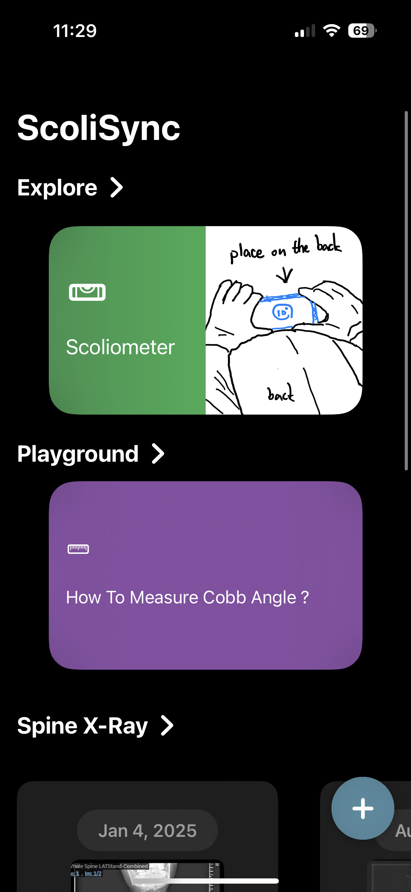
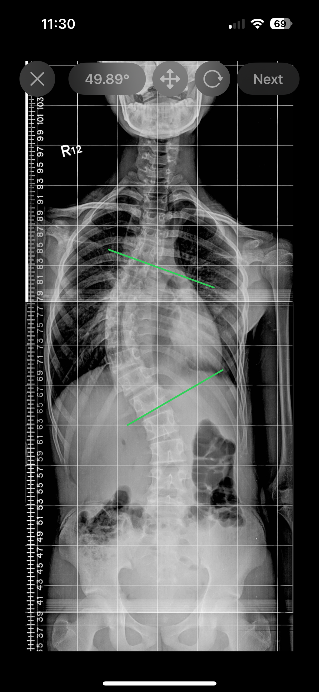
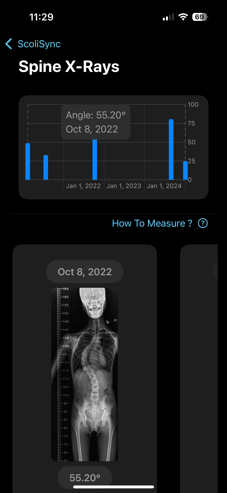

# 脊椎側彎追蹤應用程式
## Scoliosis Tracking Application

### 概述 Overview

這是一款專為脊椎側彎患者設計的 iOS 應用程式，使用 SwiftUI 框架開發，旨在幫助患者輕鬆記錄和追蹤病情，確保及時發現病情惡化。

This is an iOS application specifically designed for scoliosis patients, developed using the SwiftUI framework. It aims to help patients easily record and track their condition, ensuring timely detection of any worsening symptoms.

---

### 主要功能 Main Features

#### 1. 柯布角度測量 (Cobb Angle Measurement)

**功能描述 Feature Description:**
- 提供簡潔直觀的測量介面
- 用戶可以用手指在螢幕上畫線來測量柯布角度
- 精確的角度計算和顯示
- 支援多點測量和角度調整

**使用方式 How to Use:**
1. 開啟柯布角度測量功能
2. 在 X 光片上標記脊椎彎曲的頂端和底端椎體
3. 用手指畫出垂直於椎體終板的線條
4. 系統自動計算並顯示柯布角度

**技術實現 Technical Implementation:**
- 使用 SwiftUI 的手勢識別
- 自定義繪圖引擎
- 精確的幾何角度計算

#### 2. 脊椎側彎測量器 (Scoliometer)

**功能描述 Feature Description:**
- 利用 CoreMotion 框架
- 使用設備內建感測器
- 創建專業的脊椎側彎測量工具
- 即時角度傾斜檢測

**使用方式 How to Use:**
1. 患者採取前彎測試姿勢
2. 將設備放置在患者背部脊椎位置
3. 應用程式讀取感測器數據
4. 顯示脊椎傾斜角度和相關數值

**技術實現 Technical Implementation:**
- CoreMotion 框架整合
- 加速度計和陀螺儀數據處理
- 實時數據濾波和校準
- 精確度優化算法

#### 3. 角度記錄與追蹤 (Angle Recording and Tracking)

**功能描述 Feature Description:**
- 使用 SwiftData 儲存測量結果
- 同時記錄柯布角度和脊椎側彎測量器數據
- 以圖表形式呈現歷史數據
- 趨勢分析和病情追蹤

**數據管理 Data Management:**
- **儲存功能**: 自動儲存每次測量結果
- **時間標記**: 記錄測量日期和時間
- **數據分類**: 區分不同類型的測量數據
- **備註功能**: 允許添加測量時的備註信息

**視覺化呈現 Data Visualization:**
- 折線圖顯示角度變化趨勢
- 長條圖比較不同時期數值
- 顏色編碼標示嚴重程度
- 可匯出報告供醫師參考

**技術實現 Technical Implementation:**
- SwiftData 本地數據儲存
- Charts 框架製作圖表
- 數據持久化和同步
- 隱私保護和數據安全

#### 4. 柯布角度測量體驗區 (Cobb Angle Measurement Playground)

**功能描述 Feature Description:**
- 教育性互動體驗
- 讓任何用戶了解脊椎側彎測量方式
- 模擬真實測量環境
- 提供測量指導和說明

**學習內容 Learning Content:**
- 脊椎側彎基礎知識
- 柯布角度測量標準程序
- 常見錯誤和注意事項
- 測量準確性提升技巧

#### 5. 脊椎側彎相關知識探索 (Scoliosis Knowledge Exploration)

**內容包含 Content Includes:**
- **病理知識**: 脊椎側彎成因、類型和症狀
- **診斷方法**: 各種檢查和評估方式
- **治療選項**: 保守治療和手術治療介紹
- **日常管理**: 運動、姿勢和生活建議
- **最新研究**: 相關醫學研究和治療進展

---

### 技術規格 Technical Specifications

**開發框架 Development Framework:**
- SwiftUI (用戶介面)
- CoreMotion (感測器數據)
- SwiftData (數據儲存)
- Charts (數據視覺化)

**系統需求 System Requirements:**
- iOS 17.0 或更高版本
- iPhone/iPad 設備
- 支援加速度計和陀螺儀

**隱私和安全 Privacy & Security:**
- 本地數據儲存
- 無雲端同步(保護隱私)
- 符合醫療數據保護規範
- 用戶完全控制數據

---

### 使用對象 Target Users

**主要用戶 Primary Users:**
- 脊椎側彎患者
- 患者家屬
- 復健治療師
- 醫療專業人員

**次要用戶 Secondary Users:**
- 醫學生和實習生
- 對脊椎健康關注的一般大眾
- 健康教育工作者

---

### 應用價值 Application Value

**對患者的益處 Benefits for Patients:**
- 便捷的居家監測工具
- 及時發現病情變化
- 增進對疾病的了解
- 提升治療配合度

**對醫療專業人員的價值 Value for Healthcare Professionals:**
- 獲得更多患者數據
- 改善診療決策品質
- 提升患者參與度
- 遠程監控可能性

---

### 未來發展 Future Development

**功能擴展 Feature Expansion:**
- AI 輔助診斷建議
- 醫師平台整合
- 多語言支援
- Apple Health 整合

**技術升級 Technology Upgrades:**
- 機器學習算法優化
- AR/VR 測量體驗
- 雲端同步選項
- 穿戴設備支援

---

*本應用程式旨在輔助脊椎側彎的監測和管理，不能替代專業醫療診斷和治療。使用者應定期諮詢醫療專業人員並遵循醫師建議。*

*This application is designed to assist in scoliosis monitoring and management and cannot replace professional medical diagnosis and treatment. Users should regularly consult healthcare professionals and follow medical advice.*
